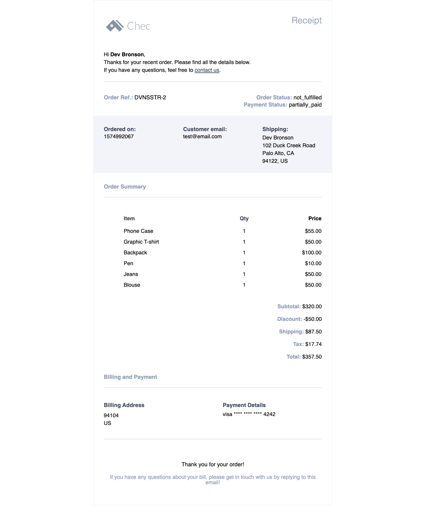

# Chec e-receipt email template with MJML 

This is a basic tutorial of creating your own custom e-receipt for your customers who have just made a purchase on your Chec e-Commerce website. We will be using MJML, an email templating framework to help with design and formatting. Be sure to give a read-over of [MJML docs](https://mjml.io/documentation/) to familiarize yourself a bit with MJML syntax. The best thing about MJML is the responsive templating, all tags and attributes are responsive, eliminating the hassle (because who really loves coding emails amiright) and thus giving time to actually code out your receipt data to your customers.  

We have made up this boilerplate template for you to start with. This bareboned template lays out all the necessary details your customer would look for in an e-receipt/invoice. So go head, clone this template and make it your own!



## What you will need to start this project

There are several different ways of installing and using MJML. For the sake of this tutorial and for a quick start, we chose to download MJML as a plugin in Visual Studio Code. Check out [MJML docs](https://mjml.io/documentation/#usage) for other usages.

* IDE Code Editor: VSCode, Atom, Sublime
* NPM or yarn
* MJML extension on code editor
* Basic knowledge of HTML syntax


## Lets start!

The first step is clone this repository locally. To do so follow these steps:

1. Open your Terminal window and navigate into your local directory where you want clone this repo

2. Once you're in the directory, type in:

``` git clone https://github.com/chec/chec-receipt.git ```

3. You now have a local copy of the merchant receipt template in your directory!

### Some things to note

Since you will be scaffolding this project and customizing it to fit the design of your e-receipt, we will go through a few explanations and things to note about the setup, structure and files on this project.

Be sure you have 


