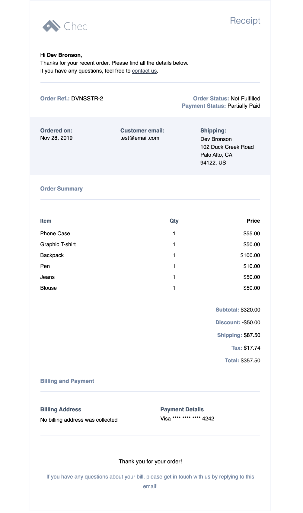

# Example Chec e-receipt email template with MJML 

This is a basic tutorial of creating your own custom e-receipt for your customers who have just made a purchase on your Chec e-Commerce website. Customized order receipts help to engage your customers, confirm that the purchase made on your website was successful and also help to generate future purchases. 

We will be using MJML, an email templating framework to help with design and formatting. Be sure to give a read-over of [MJML docs](https://mjml.io/documentation/) to familiarize yourself a bit with MJML syntax. The best thing about MJML is the responsive templating, all tags and attributes are responsive, eliminating the hassle (because who really loves coding emails amiright) and thus giving time to actually code out your receipt data to your customers.  

We have made up this boilerplate template for you to start with. This bareboned template lays out all the necessary details your customer would look for in an e-receipt/invoice. So go head, clone this template and make it your own!



## What you will need to start this project

There are several different ways of installing and using MJML. For the sake of this tutorial and for a quick start, we chose to download MJML as a plugin in Visual Studio Code. Check out [MJML docs](https://mjml.io/documentation/#usage) for other usages.

* IDE Code Editor: VSCode, Atom, Sublime
* NPM or yarn
* MJML extension on code editor
* Basic knowledge of HTML syntax

## What this email template includes:

- Your custom company logo
- Customer reference number
- Order status
- Payment status
- Order date
- Customer email
- Shipping address
- Ordered items:
  - Product name
  - Quantity
  - Price
- Order Total 
- Billing address
- Payment details
- Thank you footer

## Lets start!

The first step is clone this repository locally. To do so follow these steps:

1. Open your Terminal window and type:

``` 
git clone https://github.com/chec/example-chec-receipt-mjml.git email-receipt-template
```

2. Navigate into the repo:

``` 
cd email-receipt-template
```

3. You now have a local copy of the merchant receipt template in your directory!

## Some things to note

Since you will be scaffolding this project and customizing it to fit the design of your e-receipt, we will go through a few explanations and things to note about the setup, structure and files on this project.

Be sure you have MJML installed otherwise you will not be able to use the built-in MJML tags and have them rendered into HTML. 

As you can see our project folder includes:

- `template.mjml` which is the native MJML file that we will be coding out our receipt content
- `template.html` is where the HTML code is transpiled with the MJML machine
- `data.json` is where our Chec receipt object data is being pulled from
- `index.html` is where we are including the `handlebars.js` CDN to parse our receipt object data in the mustache expressions into actual values

For this tutorial, we have pulled in data from a Chec demo store. Working with an actual receipt object, we can then use dot notations in the handlebars expression correctly to execute the property values onto our template.  

## Let's dive a bit deeper

We will deliberately be leaving out details on MJML syntax and instead focus on the overall concept of structuring out your receipt content and working with your receipt data. Depending on the email client you are using to send your receipts, some services allow you to directly fetch your receipt object from the client's API upon every successful payment. You could also alternatively send your receipts manually from the Chec dashboard. 

### Let's take a look at our index code

```javascript
<!-- Include Handlebars CDN -->
<script src="https://cdn.jsdelivr.net/npm/handlebars@latest/dist/handlebars.js"></script>
<script src="https://cdnjs.cloudflare.com/ajax/libs/jquery/3.4.1/jquery.min.js"></script>
<script>
 
 $.getJSON('data.json', function(data) {

     window.data = data;
     $.get("template.html", function( html ) {
  
        var template = Handlebars.compile(html);
        $(document).ready(function(){
            $('#render').html(template(data));
        });
        }, 'html');

 })

</script>

<div id="render"></div>
```
1. First we need to include the `handlebars.js` CDN as well as the minified jquery if you are sticking to writing this code in jQuery.

2. We then write a function to compile the json data and template into HTML.

3. Lastly, we create an empty `div` to output the rendered email template.

### Now let's have a look at template.mjml

MJML based its syntax off of HTML, so there are definitely similarities in the way a MJML file is structured and nested.

To make it easy for you to get up and running, we have utilized the custom components features in MJML in the `mj-attributes` tag. Feel free to add to or change any class components you wish according to the design of your email receipt.

We have injected mustache expressions throughout our email template to parse our receipt data. We enter into JavaScript land with anything wrapped between the double curly braces. Note that the mustache expressions are not unique to MJML. 

As we go down the code, we have our first mustache expression `{{shipping.name}}`. When you refer to the full json data, you can see that `shipping` is the fifth data object. The dot notation after `shipping` takes us a level deeper into the nested object property `name` where we can then parse out the actual value. The rest of the mustache expressions are written in the same structure. Well what happens when you need to loop through more complex data like nested property array items such as the `order` object:

```javascript
"order": {
    "line_items": [
        {
        "id": "item_7RyWOwmK5nEa2V",
        "product_id": "prod_7ZAMo136xlNJ4x",
        "product_name": "Phone Case",
        "quantity": 1,
        "price": {
            "raw": 55,
            "formatted": "55.00",
            "formatted_with_symbol": "$55.00",
            "formatted_with_code": "55.00 USD"
            },
        }
    ]
}
```

Fortunately for us, handlebars comes fully packed with [Block Helpers](https://handlebarsjs.com/guide/block-helpers.html#basic-blocks). 

> Block helpers make it possible to define custom iterators and other functionality that can invoke the passed block with a new context. This seems like best use case to iterate through our deeply nested properties. 

You can loop through the order object properties by invoking the parent object like so `{{#order}}`

```
{{#order.line_items}}
    {{product_name}} 
{{/order.line_items}}
```

Alternatively, you can use the `#with` helper to avoid repeating the parent object: 

```
{{#with order.line_items}}
    {{product_name}} 
{{/with}}
```

## Running build to finish your email receipt

MJML comes built in with its own CLI to easily build your template.

After you've made your changes and are ready to render the MJML template out into HTML, you can run the command below:

```
mjml -r template.mjml -o template.html
```

`template.mjml` is the input file and `template.html` is the output file where the rendered HTML goes.

With the generated HTML, you can now send your responsive receipt with your email client service or directly from your shell. 

## The finish line

And there you have it! See, we told you it was easy as pie, or did we not? Well now you know, how simple it is to create your own customized Chec e-receipt to send to your valued customers. 

Thank you for walking through the tutorial with us!


